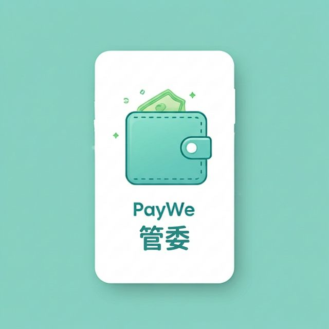

# PayWe - 多人分帳與債務簡化系統

> **"這不只是一個記帳工具，而是一場讓分帳變得更簡單的無縫體驗。"**


## 🔗 線上體驗 (Demo)

👉 **[點擊這裡前往 PayWe](https://paywe-guanwei.vercel.app/)**

> ⚡ 快速體驗帳號  
> Email：test123@gmail.com  
> Password：123456

## 🎯 設計宗旨 (Mission)

這個專案的起點，來自於我與家人日常相處的經驗，每次一起出門消費後，總會在最後結算時花上不少時間釐清誰該付多少，甚至因為計算過程繁瑣而感到困擾。因此，我希望打造一個真正「能被自己與家人使用」的工具，解決這個生活中反覆出現的問題。

而市面上的分帳軟體多半專注於「記帳」本身。然而，在多人出遊、長期合租的場景中，最令人困擾的往往不是記錄每一筆開銷，而是最後結算時 **「複雜交叉的債務關係」與「繁瑣的轉帳次數」**。

此專案透過 **Google Stitch** 將設計構想精準轉化為高品質的實作，並整合 **Supabase** 作為後端系統，負責所有數據的即時同步與安全管理，結合了現代化的 UI 設計、穩定的後端架構與高效的「債務簡化算法」，將錯綜複雜的金錢往來，自動轉化為最少次數的轉帳交易，讓分帳不再成為負擔。

## ✨ 特色功能 (Features)

### 1. 🖥️ 極致流暢的操作體驗 (Immersive & Seamless UI)
不再是繁雜的表單與數據。打造了基於現代化設計語言、具有流暢動畫與即時反饋的操作介面。在這裡，你可以直覺地建立群組、新增費用，享受無縫絲滑的交互體驗。

### 2. 🔮 智慧債務簡化核心 (Smart Debt Simplification)
這不是單純的加總，系統內建高效結算演算法，能在一鍵產生結算方案時：
-   **自動抵銷 (Debt Cancellation)**：群組內的所有交叉債務自動相抵。
-   **最小化交易 (Minimize Transactions)**：將原本需要多次轉帳的複雜關係，簡化為最少的匯款次數（誰給誰多少錢）。

### 3. 🛡️ 實時同步與數據安全 (Real-time Sync & Security)
專案整合了 Supabase 雲端後端服務，強調 **隨時隨地、多人同步** 的概念。每一筆新增的費用都會即時更新，確保所有群組成員都能隨時隨地掌握最新的分帳進度，避免資訊落差。

### 4. 🎮 完整的群組生命週期管理 (Group Lifecycle)
透過這套系統，分帳就像是一個有始有終的任務。從「邀請成員」、「花費記錄」、「一鍵結算」，直到最後的「永久封存」，將結算後的數據鎖定並排除於儀表板統計，提供清晰的財務視野。

### 5. 📱 漸進式網頁應用體驗 (Progressive Web App - PWA)
不需透過 App Store 即可將應用程式「安裝」至手機系統主畫面，享有類原生的順暢體驗、獨立的大視窗與全畫面沉浸感，讓你在各種跨平台移動設備上都能隨時輕鬆記帳。

### 6. 🧪 高可靠性自動化測試 (Robust E2E Testing)
導入 **Playwright** 建立完整的端到端測試，從首頁、使用者驗證、群組建立、費用管理到最關鍵的「複雜結算算法」，皆透過可靠的自動化測試覆蓋，確保提供無懈可擊的使用品質與應用穩定性。


## 🛠️ 技術堆疊 (Tech Stack)

本專案採用現代化的前端與 Serverless 技術構建：

-   **前端開發:** React 19 + TypeScript
-   **建置工具:** Vite
-   **設計實作:** Google Stitch (用於快速生成與迭代高品質的 UI 介面)
-   **樣式與組件:** Tailwind CSS v4 + Radix UI / Shadcn UI
-   **後端與資料庫:** Supabase
-   **動畫效果:** Framer Motion + tw-animate-css
-   **專案部署:** Vercel
-   **端到端測試:** Playwright
-   **進階網頁技術:** PWA (Progressive Web App)

## 📁 專案資料夾結構 (Project Structure)

```text
paywe-guanwei/
├── playwright/             # Playwright 測試用環境與輔助設定
│   ├── .auth/              # 測試時的登入驗證狀態暫存區
│   └── global-setup.ts     # 測試啟動前的全域前置設定區
├── public/                 # 靜態資源 (圖示、圖片、PWA Manifest等)
├── src/
│   ├── components/         # 共用 UI 組件 (如 Button, Form, Layout)
│   ├── hooks/              # 自定義 Hooks (封裝商業邏輯如 useAuth, useGroup)
│   ├── lib/                # 外部工具設定 (如 Shadcn UI utils)
│   ├── pages/              # 頁面視圖 (如 Home, Settings, Settlement)
│   ├── types/              # TypeScript 共享型別定義
│   ├── utils/              # 共用輔助函式庫 (包含結算演算法等)
│   ├── App.tsx             # 應用程式主要進入點與路由設置
│   ├── index.css           # 全域樣式與 Tailwind CSS 設定
│   ├── main.tsx            # React 渲染掛載點
│   └── supabase.ts         # Supabase 用戶端設定與連線
├── tests/                  # Playwright 端到端自動化測試腳本 (E2E Tests)
│   ├── auth.spec.ts        # 驗證機制與登入測試流程
│   ├── create-group.spec.ts# 建立與管理群組功能測試
│   ├── expense.spec.ts     # 新增與分配費用測試流程
│   ├── settlement-math.spec.ts # 複雜債務簡化與計算邏輯測試
│   └── settlement.spec.ts  # 結算操作介面與交互測試
├── components.json         # Shadcn UI 設定檔
├── eslint.config.js        # ESLint 語法檢查配置
├── package.json            # 專案套件依賴與管理腳本
├── playwright.config.ts    # Playwright 測試與設定檔
└── vite.config.ts          # Vite 開發、編譯打包與 PWA 設定
```
